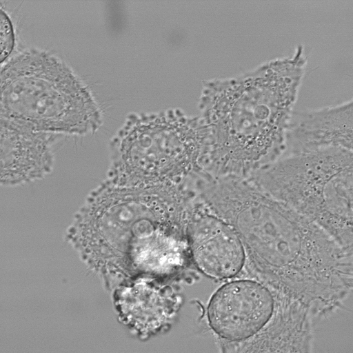
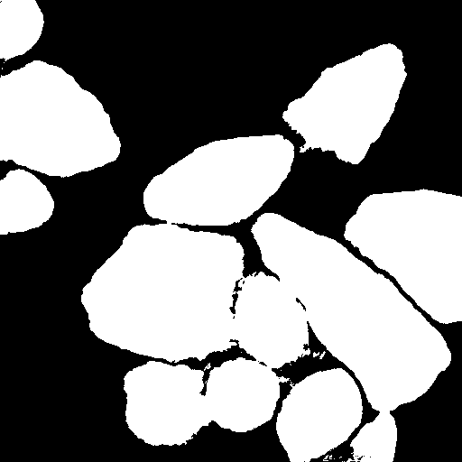

# DIC-C2DH-HeLa

U-Net cell segmentation on the [DIC-C2DH-HeLa dataset](https://celltrackingchallenge.net/2d-datasets/). I intent to make this my submission for the [Cell Tracking Challenge](https://celltrackingchallenge.net/).

## Architecture and training

I used Tensorflow to implement [the original U-Net network architecture](https://doi.org/10.1007/978-3-319-24574-4_28)[1] with an added zero padding step after each convolutional layer. The binary cross-entropy loss with the distance-based pixel weight maps described in the original paper has also been implemented. Different data augmentation methods were explored, mainly geometric variations such as rotations, [elastic deformation](https://doi.org/10.1109/ICDAR.2003.1227801)[2] and [grid distortion](https://doi.org/10.3390/info11020125)[3]. To correct gray value variations and to avoid an extra step of data augmentation, I added a [Contrast Limited Adaptive Histogram Equalization (CLAHE)](https://doi.org/10.1109/VBC.1990.109340)[4] pre-processing step using OpenCV.

## Results

The original training dataset are two different segments of a recording. I used both of these segments as a training-validation pair in a round-robin fashion (basically GroupKFold cross-validation). The results were:

- Average out-of-fold IoU: 0.844340
- Average out-of-fold dice loss: 0.141248

I'm yet to submit the predictions made by the network to the Cell Tracking Challenge organizers.

Here is the predicted segmentation mask for the 01/t007.tiff example in the test dataset. It lacks a ground truth mask and therefore was never seen during training, though I suppose I could try a Noisy Student approach in the future.

    

## References

[1] Ronneberger, O., Fischer, P., Brox, T. (2015). U-Net: Convolutional Networks for Biomedical Image Segmentation. In: Navab, N., Hornegger, J., Wells, W., Frangi, A. (eds) Medical Image Computing and Computer-Assisted Intervention – MICCAI 2015. MICCAI 2015. Lecture Notes in Computer Science(), vol 9351. Springer, Cham. doi.org/10.1007/978-3-319-24574-4_28

[2] P. Y. Simard, D. Steinkraus and J. C. Platt, "Best practices for convolutional neural networks applied to visual document analysis," Seventh International Conference on Document Analysis and Recognition, 2003. Proceedings., Edinburgh, UK, 2003, pp. 958-963, doi: doi.org/10.1109/ICDAR.2003.1227801

[3] Buslaev, A.; Iglovikov, V.I.; Khvedchenya, E.; Parinov, A.; Druzhinin, M.; Kalinin, A.A. Albumentations: Fast and Flexible Image Augmentations. Information 2020, 11, 125. https://doi.org/10.3390/info11020125

[4] S. M. Pizer, R. E. Johnston, J. P. Ericksen, B. C. Yankaskas and K. E. Muller, "Contrast-limited adaptive histogram equalization: speed and effectiveness," [1990] Proceedings of the First Conference on Visualization in Biomedical Computing, Atlanta, GA, USA, 1990, pp. 337-345, doi: doi.org/10.1109/VBC.1990.109340